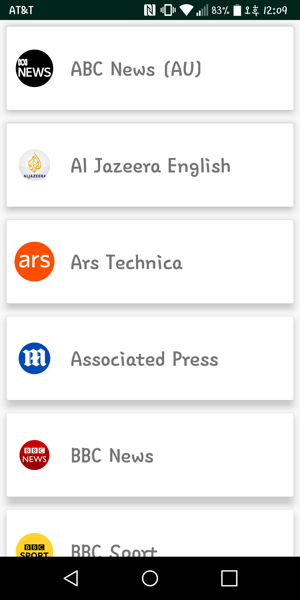
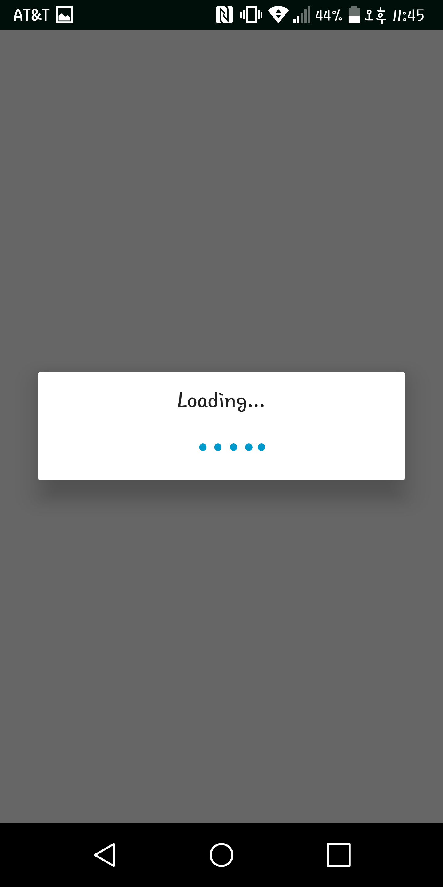
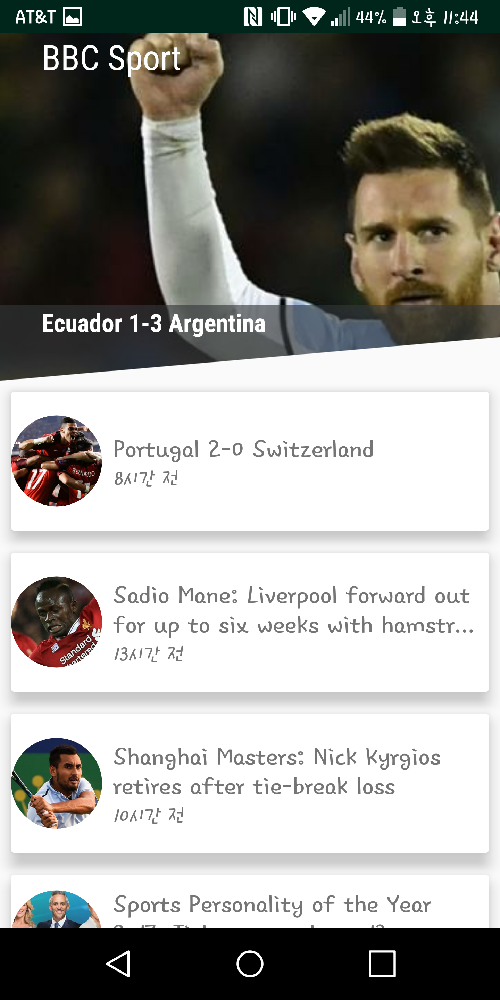
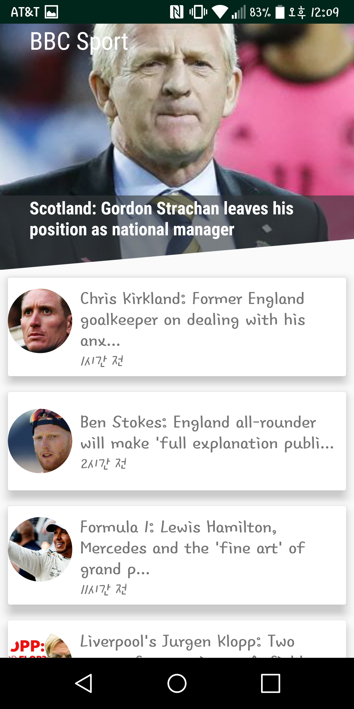
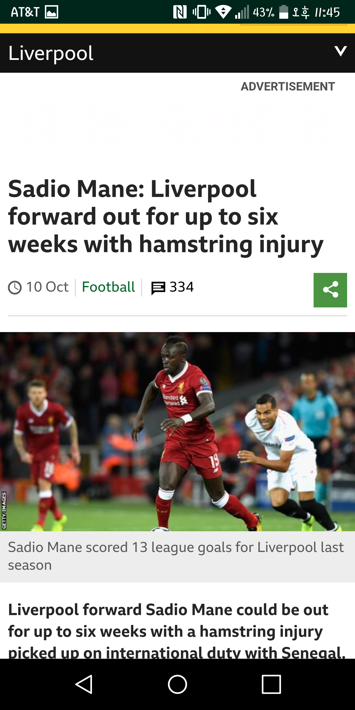

# NewsApp-Upgraded Version

The main activity is composed of many new sources. 
When user select one of sources, the app shows many articles according to the source user choose. 
In the newList activity, the latest article is shown at Diagonal Layout with Kenburns effect to make it better. 
Lastly, when user click one of articles, the article will be shown through webview.

## With News API and Libraries
  - http://newsapi.org
  
  <ul>The app uses third party libraries such as:
  
     - Picasso for easily fetching images from URL's.
     - Retrofit2 to fetch data. 
     - Paper for Cache. 
     - Diagonal layout. 
     - Kenburns Effect. 
     - Recycler View and View click.
  </ul>

## Screent Shots

    

